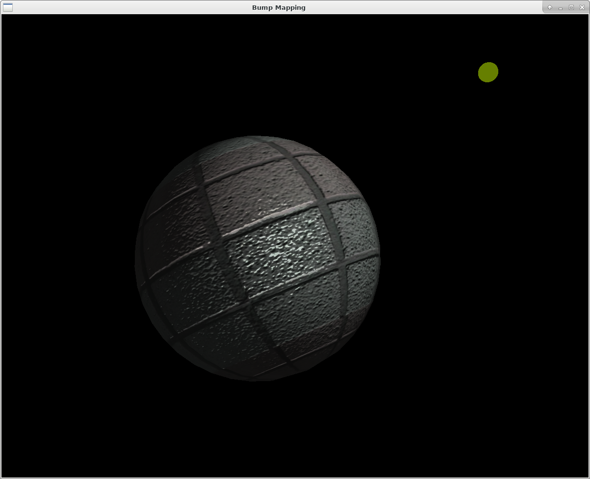
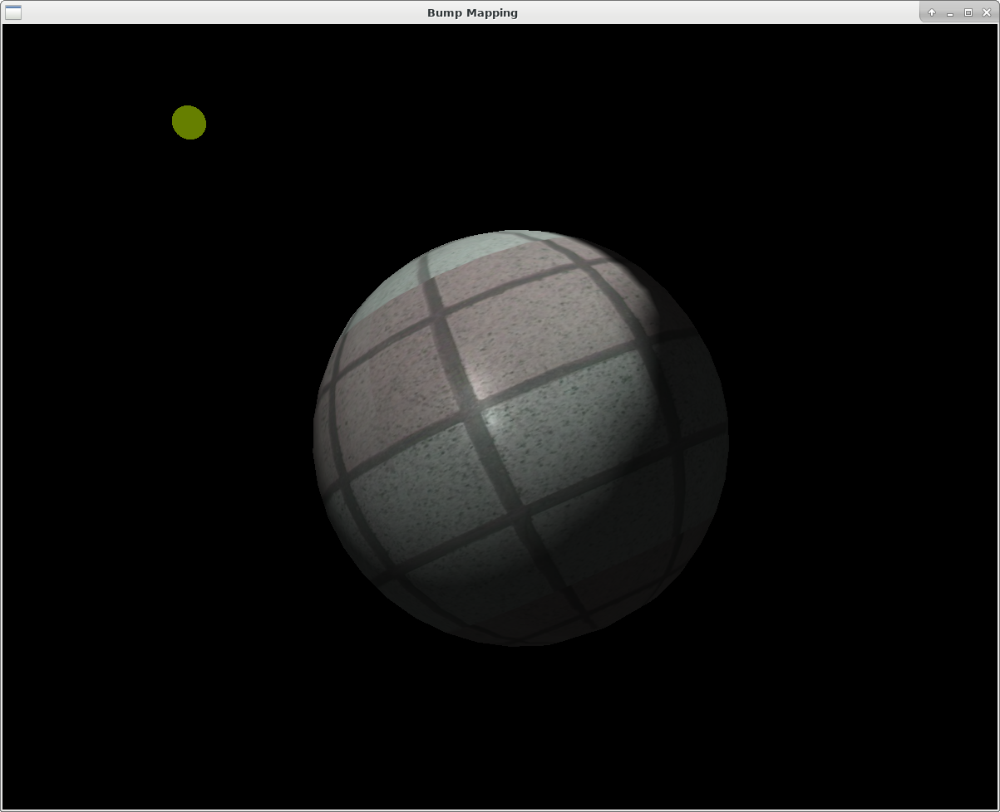

# Bump Mapping Demo

Computer graphic bump mapping demo using OpenGL

| Bump mapping ON | Bump mapping OFF
|--|--
|  | 

## compile

+ dependencies:

    - opengl
    - glu
    - glut
    - glew
    - [devernay/glm](https://github.com/devernay/glm/)
    - libjpeg (from glm)
    - libpng (from glm)
    - autoconf (makedepend, from glm)
    - libtool (makedepend, from glm)
    - automake (makedepend, from glm)

+ build glm

    ```sh
    ./build_glm.sh
    ```

+ build program

    ```sh
    make
    ```

    -or- use vscode task

Only tested under archlinux + gcc7. Know some issue on mac, not going to solved.

## execute

```sh
./ball
```

## operation

- mouse drag: change perspective
- `z`: move light source to front of camera
- `x`: move ball to front of camera
- `c`: reset all pose
- `b`: toggle bump mapping

| +z | -z | +y | -y | +x | -x |target
|----|----|----|----|----|----|----
|`w` |`s` |`a` |`d` |`q` |`e` | move camera
|`t` |`g` |`f` |`h` |`r` |`y` | move light source
|`u` |`j` |`h` |`k` |`y` |`i` | move object
|`9` |`6` |`8` |`5` |`7` |`4` | rotate object along axis
