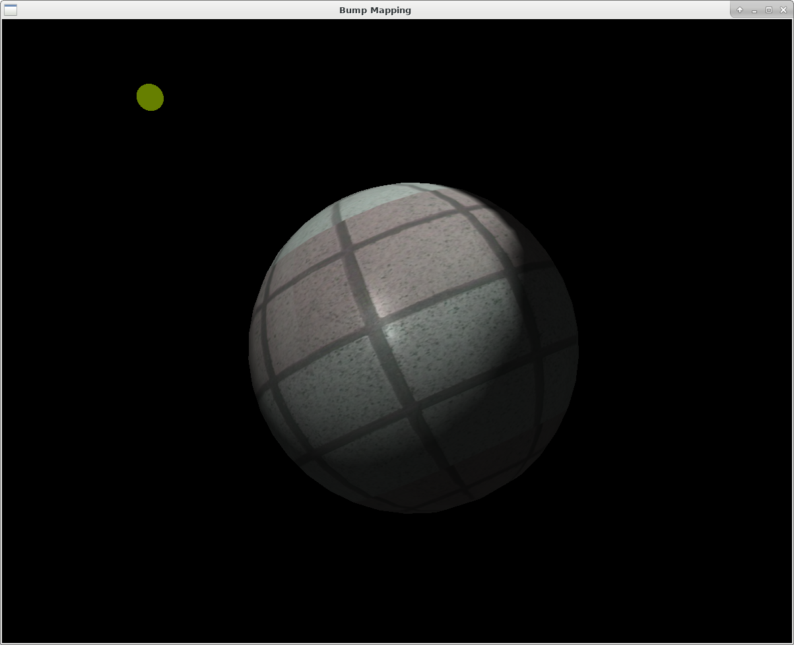

This script rendered use [shd101wyy/markdown-preview-enhanced](https://shd101wyy.github.io/markdown-preview-enhanced/#/)

# Computer Graphics Assignment 3

**table of content**

<!-- @import "[TOC]" {cmd="toc" depthFrom=2 depthTo=6 orderedList=false} -->
<!-- code_chunk_output -->

* [Screenshot](#screenshot)
* [Keymap](#keymap)
* [Files](#files)
* [Logic](#logic)
	* [coordinate space](#coordinate-space)
		* [*model matrix* and *view matrix*](#model-matrix-and-view-matrix)
		* [*tangent space*](#tangent-space)
	* [shading](#shading)
		* [vertex shader](#vertex-shader)
		* [fragment shader](#fragment-shader)

<!-- /code_chunk_output -->

## Screenshot

+ bump mapping on

+ bump mapping off

## Keymap

*NO change to example code*

- mouse drag: change perspective
- `z`: move light source to front of camera
- `x`: move ball to front of camera
- `c`: reset all pose
- `b`: toggle bump mapping
- `esc`: exit demo

| +z | -z | +y | -y | +x | -x |target
|----|----|----|----|----|----|----
|`w` |`s` |`a` |`d` |`q` |`e` | move camera
|`t` |`g` |`f` |`h` |`r` |`y` | move light source
|`u` |`j` |`h` |`k` |`y` |`i` | move object
|`9` |`6` |`8` |`5` |`7` |`4` | rotate object along axis

## Files

most code from example are moved to `src/interaction.cpp` (to prevent `main.cpp` too long to scroll)

all code for this assigment is in `src/main.cpp` and shaders are in `shaders` folder

## Logic

### coordinate space

this chart helps me a lot![^coord]

[^coord]: chart source: http://www.paulsprojects.net/tutorials/simplebump/simplebump.html

#### *model matrix* and *view matrix*

Since there's no api to get *view matrix* and *model matrix* directly, it use another method to get it:

After `glLoadIdentity` and `gluLookAt` (in the *do-not-modify* section) we could get the projection matrix and modelview matrix.

Since there is no any translation or rotation after `glLoadIdentity` the model matrix should be identity.

$$
\begin{align}
M_\text{modelview}
&= M_\text{view} \cdot M_\text {model} \\
&= M_\text{view} \cdot \mathbf{I}_{4\times4}
\end{align}
$$

So we know at very that time we could get the view matrix by `GL_MODELVIEW_MATRIX`.

#### *tangent space*

TA's slide offers the algorithm to get tangent and bitangent. Then we could transform vertex from model space to tanget space.

$$
\begin{bmatrix}
V_x \\
V_y \\
V_z
\end{bmatrix}_\text{tangent}
= \begin{bmatrix}
T_x & T_y & T_z \\
B_x & B_y & B_z \\
N_x & N_y & N_z
\end{bmatrix} \begin{bmatrix}
V_x \\
V_y \\
V_z
\end{bmatrix}_\text{model}
$$

### shading

#### vertex shader

Vectors are given in different coordinate spaces. It transforms them into model space of ball, do the calculation, then transform to tangent space and passed to fragment shader.

+ vertex position

    $$
    \text{gl_Position} =
    M_\text{proj}
    M_\text{mv}
    \vec{V}_\text{model}
    $$

+ light direction

    $$
    \begin{align}
        \vec{L}_\text{model}
        &=
        {M}_\text{mv}^{-1}
        {M}_\text{view}
        \vec{L}_\text{world}
    \\
        \overrightarrow{VL}_\text{tangent}
        &=
        M_\text{TBN} \left(
            \vec{L} - \vec{V}
        \right)
    \end{align}
    $$

+ halfway vector

    first we calculate camera position in model space. we know camera should at $(0, 0, 0)$ in camera space.

    $$
    \vec{C}_\text{model} =
    {M}_\text{mv}^{-1} \begin{bmatrix} 0 \\ 0 \\ 0 \\ 1 \end{bmatrix}
    $$

    then calculate the halfway vector

    $$
    \vec{H}_\text{tangent}
    = M_\text{TBN} \cdot \left(
        \overrightarrow{VL} + \overrightarrow{VC}
    \right)
    $$

#### fragment shader

+ normal vector

    if `use_bump` is enable, it get normal from the normal map. Or it use $(0, 0, 1)$

+ ambient

    copy from material

+ diffuse

    $$
    I_d =
    K_d \cdot \max{ \left(
        \vec{N} \bullet \overrightarrow{VL}, 0
    \right) }
    $$

+ specular

    $$
    I_s =
    K_s \cdot \left(
        \vec{N} \bullet \vec{H}
    \right) ^\alpha
    $$

+ display color

    it get the base color $C$ from texture

    $$
    C_\text{display} = C_\text{base} \left(
        I_a + I_d + I_s
    \right)
    $$
